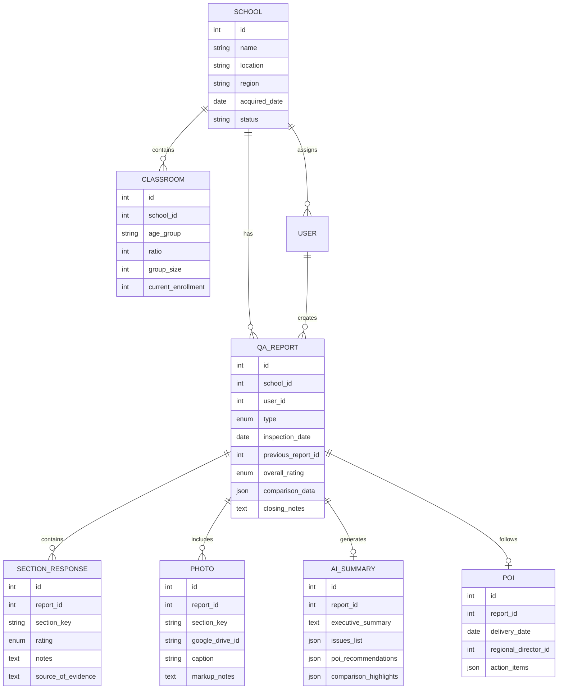

# QA Report Management Application - Source of Truth

> **Last Updated:** January 2, 2026  
> **Status:** Planning Phase - Document Analysis Complete  
> **Company:** Chroma Early Learning Academy

---

## 1. Project Overview

A web application for managing and generating QA (Quality Assurance) Reports for Chroma Early Learning Academy schools. The system will support multiple schools, store historical data, enable report comparisons, and leverage AI for intelligent document processing and analysis.

---

## 2. Deployment Decision

> [!IMPORTANT]
> **Chosen Deployment: WordPress Plugin**

| Requirement | Decision |
|-------------|----------|
| **Platform** | WordPress Plugin |
| **Offline Access** | Not required |
| **Export Format** | PDF |
| **Historical Data** | Last 2 visits per school |

---

## 3. Core Features

### 3.1 Authentication
- **Google OAuth 2.0** integration for company accounts
- Role-based access control (Admin, QA Inspector, Viewer)
- Session management and security

### 3.2 Multi-School Support
- Support for **up to 100 schools**
- Individual school profiles and configurations
- School-level data isolation
- Bulk operations and reporting across schools

### 3.3 QA Report Types

| Type | Description | Structure |
|------|-------------|-----------|
| **New Acquisition** | Initial QA assessment for newly acquired schools | Full comprehensive checklist |
| **Tier 1** | Primary/regular QA inspection reports | Standard compliance checklist |
| **Tier 1 + Tier 2** | Full inspection with CQI add-on | Tier 1 + Continuous Quality Improvement checklist |

> [!NOTE]
> **Tier 2 is NOT a standalone report** — it extends Tier 1 with additional inspection items focused on Continuous Quality Improvement (CQI). When creating a Tier 2 report, the system will include all Tier 1 sections plus the Tier 2 add-on sections.

### 3.4 Data Storage
- **Primary:** Application database (MySQL/PostgreSQL)
- **Secondary:** Google Drive integration for:
  - Document backups
  - Photo storage (organized by section/area)
  - Archive storage (save server space)

### 3.5 Report Comparison
- Side-by-side comparison with previous reports (overlay format)
- Visual diff highlighting with color coding (e.g., GREEN for follow-up notes)
- Trend analysis across multiple reports
- Progress tracking on previously identified issues
- CQI (Continuous Quality Improvement) tracking

### 3.6 Photo Management
- Upload photos directly to reports
- **Google Drive integration** for photo storage
- Insert photos from existing Google Drive folders
- Photo annotation and categorization by area:
  - Gym/Game Room/Unused Space
  - Pre-School/After School
  - Twos Classroom
  - Vehicles (Bus/Van)
  - Playgrounds
  - Kitchen/Laundry
  - Lobby/Office
  - Classrooms
- Automatic image optimization

---

## 4. AI Features

### 4.1 Document Parsing
- Parse existing QA reports (Word documents)
- Extract structured data from checklist tables
- Import historical reports with baseline data
- OCR for scanned documents (if needed)

### 4.2 AI Executive Summary
- **Automated comparison** with previous report (baseline)
- **Current report issues** identification and severity rating
- **Points of Interest (POI)** highlighting
- Actionable recommendations
- Overall rating suggestion (Exceeds / Meets / Needs Improvement)

### 4.3 AI Assistance
- Smart form field suggestions based on historical patterns
- Auto-completion based on previous inspection data
- Anomaly detection (unusual patterns)
- Compliance checking against DECAL regulations

---

## 5. Detailed Report Structure (Based on Document Analysis)

### 5.1 Report Header
| Field | Description |
|-------|-------------|
| Campus/School Name | Name of the school being inspected |
| Inspection Date | Date of the QA visit |
| Report Type | New Acquisition / Tier 1 / Tier 1+2 |
| Corporate Staff Conducting Visit | QA Officer name |
| Program Management | School management names |
| Previous Report Reference | Link to baseline/previous report for comparison |

### 5.2 Rating System
Each checklist item uses a consistent rating:
- ✅ **Yes / Consistently** (XX or checkmark)
- ⚠️ **Sometimes / Needs Work** (X or partial)
- ❌ **No / Not Yet in Place** (blank or X in No column)
- 📝 **Notes/Comments** (inline observations)

### 5.3 Overall Report Rating
- ☐ **Exceeds** - Exceptional compliance and quality
- ☐ **Meets** - Satisfactory compliance
- ☐ **Needs Improvement** - Action required

---

## 6. Tier 1 Checklist Sections

### 6.1 State Compliance
| Item | Fields |
|------|--------|
| State Ratios Maintained | Yes/No |
| State Group Sizes Maintained | Yes/No |
| Past Licensing Report | Status of cited items |
| Outstanding Complaints | Yes/No with notes |

### 6.2 Classroom Ratios
| Age Group | Ratio | Group Size | Children Count |
|-----------|-------|------------|----------------|
| Infant A | 1:6 | 12 | [count] |
| Toddler | 1:8 | 16 | [count] |
| Two-year-olds | 1:10 | 20 | [count] |
| Three-year-olds | 1:15 | 30 | [count] |
| Four-year-olds | 1:18 | 36 | [count] |
| GA Pre-K | 1:10 | 20 | [count] |
| School-age | 1:25 | 50 | [count] |

### 6.3 Health & Safety
- Fire Drills (Monthly, 1 nap time drill/year)
- Tornado Drills (Every 6 months)
- Pediatric First Aid/CPR documentation
- Fire extinguishers (serviced/tagged annually)
- Emergency numbers near phones
- Allergy lists (current, posted in classrooms/kitchen)
- Medications (forms complete, stored properly)

### 6.4 Classrooms
- Infant bottles (labeled, dated, ready-to-feed)
- Refrigerators (clean, thermometers working)
- Handwashing/diapering procedures
- Supervision (sight and sound)
- Universal precautions (gloves)
- Shelves organized with labels
- Sleeping equipment stored
- Staff belongings secured
- Bulletin boards (decorated, current)
- Print-rich environment
- Learning centers (visible, stocked)
- Schedules posted
- Climate (calm, flexible, cheerful)
- Equipment/materials condition
- Photos of children present
- Process art at eye-level
- Conversations/discipline appropriate

### 6.5 Sleep/Nap
- Crib mattresses (good repair, tight sheets)
- Cribs labeled, sheets changed daily
- Infants placed on backs
- No pillows/toys/blankets in cribs
- No swaddling without physician statement
- No sleep in non-crib equipment
- Cots/mats used by same child daily
- 24" corridor, head-to-toe arrangement
- Weekly laundering

### 6.6 Kitchen/Laundry
- Kitchen cleanliness, gloves used
- Food labeled and stored properly
- Refrigerator/freezer temps correct
- Current menu and allergy list posted
- Trash containers covered
- Food kept warm until serving
- Laundry room clean, tidy, locked

### 6.7 Playgrounds
- Maintained/tidy condition
- Grass/mulch maintained (9" wood mulch, 6" rubber)
- Proper fall zone
- Equipment (no rust/mildew/sharp edges)
- Teacher supervision
- Exterior gates secured
- Interior gates with carabiner
- No entrapment hazards
- Fencing in good repair
- No tripping hazards
- Picnic tables clean
- Shade structure present
- No low-hanging branches

### 6.8 Vehicles (Bus/Van)
- Properly maintained (clean, decals, tires)
- Transportation plans/logs documented
- Seatbelts working
- Seats secured to floor
- No trash or loose equipment
- Seat covers intact
- Fire extinguisher maintained
- First Aid Kit complete
- Insurance/inspection/training docs
- Transportation logbook complete

### 6.9 Posted Notices/Signage
- Current License
- Consumer Product Safety Poster
- No Smoking sign
- Liability insurance notice
- Communicable disease chart
- Parent access statement
- Management names
- Weekly menu
- Emergency plans
- Visitor check-in notice
- DECAL Rules & Regulations

### 6.10 First Aid Kit Checklist
- Scissors, Tweezers
- Gauze Pads
- Adhesive Tape
- Thermometer
- Band-Aids (assorted)
- Insect Sting Preparation
- Antibacterial Ointment
- Antiseptic Solution
- Rubber Gloves, Cold Pack
- Triangular Bandage
- First Aid Manual, Face Mask, Eye Protection

### 6.11 Building/Curb Appeal/Maintenance
- Floors and vents clean
- Countertops/window sills dust-free
- Opening/closing checklists used
- Walls maintained (no chipping/graffiti)
- Area rugs clean, no trip hazards
- Furniture clean, good repair
- Bathroom exhaust fans operational
- Bathrooms clean, odor-free, stocked
- Quality Rated Signage displayed
- Dumpster area maintained
- Exterior free from litter
- Landscaping maintained
- Parking lot maintained

### 6.12 Lobby/Office/Staff
- Staff at front desk
- Lobby attractive and organized
- Appropriate music playing
- Dress code followed
- Director's office professional
- Adult restrooms clean
- Files secure (locked cabinet)
- GA Pre-K files complete
- Security system/wi-fi/Procare operational
- Closets clean, organized, locked

---

## 7. Tier 2 (CQI Add-On) Sections

> [!NOTE]
> Tier 2 is the Continuous Quality Improvement checklist awarded to programs that have reached a milestone of excellence.

### 7.1 Physical Environment: Health & Safety
Extended criteria for protecting children/staff while supporting health and well-being.

### 7.2 Relationships and Interactions
- Caregivers warm, responsive, nurturing
- Respectful staff communication
- Calm, flexible, cheerful climate
- Positive guidance for behavior

### 7.3 Curriculum, Learning, and Teaching Practices
- Balance of child-initiated and teacher-guided activities
- Current bulletin boards reflecting monthly theme
- Opportunities for exploration, play, problem-solving
- Supports for dual language learners
- Individualized lesson plans using observation/assessment
- Specialty classes available

### 7.4 Classroom Environment
- Organized, inviting, clutter-free
- Well-stocked learning centers (blocks, dramatic play, literacy, arts, science, sensory, music, cultural)
- Anti-bias books and diverse dolls
- Age-appropriate materials for school-age
- Process art at child's eye-level
- Staff bios with photos posted
- Labeled shelves (print-rich)
- Creative classroom door decorations
- Seasonal/event displays
- Quiet/downtime spaces available

### 7.5 Child Assessment & Individualization
- Ongoing observation and documentation
- Child portfolios maintained
- Developmental screenings (Ages & Stages Questionnaire)
- Assessments guide adaptations
- Family conferences available

### 7.6 Professionalism
- Interactions support all learning styles
- Staff adhere to dress code
- Low staff turnover
- Daily opening/closing checklists
- Regular staff meetings (monthly/quarterly)

### 7.7 Family & Community Engagement
- New family orientation with follow-up
- Annual parent surveys
- Two-way communication via Procare
- Family involvement opportunities
- Respect for family culture/language/values
- Community resource connections

### 7.8 Equity, Inclusion & Diversity
- Inclusive practices for all abilities
- Learning centers represent diverse cultures, languages, abilities, family structures

### 7.9 Leadership/Lobby/Office/Files
- Professional, inviting, Chroma-branded environment
- Required posted notices in place
- Monthly newsletters distributed
- Music playing in lobby
- Transition communication between classrooms
- Complete files with checklists
- Current DECAL Rules & Regulations available

---

## 8. Photo Documentation Structure

Photos are organized in separate documents by area:

| Document Type | Content |
|---------------|---------|
| Gym/Game Room/Unused Space | Photos of gymnasium, game rooms, unused classrooms |
| Pre-School/After School | Photos of PS and AS classroom areas |
| Twos | Photos of two-year-old classrooms |
| Vehicles | Photos of buses and vans (exterior/interior) |
| General Report | Photos embedded with markups for clarity |

---

## 9. Report Output Format

### 9.1 Structure
1. **Report Header** - School info, date, personnel
2. **State Compliance Section** - Ratios, licensing, complaints
3. **Checklist Sections** - Tables with Yes/No/Notes columns
4. **Notes Sections** - Detailed observations after each major section
5. **Overall Rating** - Exceeds/Meets/Needs Improvement
6. **Sign-off** - QA Officer signature block
7. **Photo Attachments** - Separate documents by area

### 9.2 Comparison Features
- Fall visit notes appear in **GREEN** for side-by-side CQI comparison
- Previous baseline data shown alongside current findings
- Progress indicators for previously cited items

### 9.3 Plan of Improvement (POI)
- Follows the QA report within a few days
- Delivered by Regional Director
- Lists action items with timelines

---

## 10. Technical Requirements

### 10.1 Frontend
- Responsive design (desktop, tablet, mobile)
- Modern UI/UX with intuitive navigation
- Rich text editing for notes sections
- Drag-and-drop photo uploading
- Real-time auto-save
- Color-coded comparison view
- Printable/exportable format

### 10.2 Backend
- RESTful API architecture
- Secure authentication layer
- Scalable database design
- Background job processing for AI tasks

### 10.3 Integrations
- **Google OAuth 2.0** - Authentication
- **Google Drive API** - File/photo storage
- **Google Cloud AI** (Gemini) - AI features
- **WordPress REST API** (if plugin option)
- **Procare** (potential future integration for communication)

---

## 11. User Roles & Permissions

| Role | Permissions |
|------|-------------|
| **Super Admin** | Full access, user management, system settings |
| **Regional Director** | Manage assigned schools, POI delivery, view all regional reports |
| **QA Officer** | Create/edit reports, conduct inspections |
| **Program Management** | View school's own reports, respond to findings |

---

## 12. Data Model (High-Level)

---

## 13. Open Questions

> [!WARNING]
> The following items need clarification from stakeholders:

1. **Hosting Environment:** What is the current web hosting stack?
2. **AI Provider:** Which AI provider preferred (Gemini recommended)?
3. **Offline Access:** Is offline functionality required for inspections?
4. **Export Formats:** PDF, Word, Excel requirements?
5. **Notification System:** Email alerts for due reports or POI items?
6. **Historical Data:** How many years of historical reports to support?
7. **Procare Integration:** Is integration with Procare system desired?
8. **Mobile App:** Native mobile app or responsive web sufficient?

---

## 14. Next Steps

1. ✅ Create source of truth document
2. ✅ Receive and analyze sample QA Report documents
3. ✅ Extract detailed structure from DOCX files
4. ⏳ **Create technical implementation plan**
5. Begin development

---

## 15. Future Enhancements (Roadmap)

### 15.1 Workflow Efficiency

| Feature | Description | Priority |
|---------|-------------|----------|
| **Quick Duplicate Report** | Copy previous report as starting point for follow-up visits | High |
| **Bulk Checklist Actions** | "Mark all as Yes" for compliant sections, "Copy notes from previous" | High |
| **Report Templates** | Pre-fill common notes/observations that apply to many schools | Medium |
| **Keyboard Navigation** | Arrow keys + 1/2/3/4 hotkeys for rapid checklist completion | Medium |
| **Batch Photo Upload** | Upload 20+ photos at once, assign captions/sections in bulk view | Medium |
| **Quick Issue Flagging** | Star/flag critical items during inspection for review before submit | Medium |

### 15.2 Communication & Notifications

| Feature | Description | Priority |
|---------|-------------|----------|
| **Email Notifications** | Auto-email reports to school directors when submitted/approved | High |
| **Due Date Reminders** | Dashboard alerts for schools due/overdue for QA visits | High |
| **Approval Workflow** | Regional Director → Super Admin review chain with stage comments | Medium |

### 15.3 Mobile & Field Experience

| Feature | Description | Priority |
|---------|-------------|----------|
| **Progressive Web App (PWA)** | Add to home screen, app-like experience on tablets | High |
| **Offline Mode** | Save reports locally when no internet, auto-sync when online | High |
| **Voice-to-Text Notes** | Microphone button for hands-free note dictation | Medium |
| **Simplified Mobile Wizard** | Single-column layout optimized for tablet field use | Medium |
| **GPS Location Verification** | Confirm inspector is at correct school location | Low |

### 15.4 Visual & Analytics

| Feature | Description | Priority |
|---------|-------------|----------|
| **Photo Annotations** | Draw circles/arrows on photos to highlight issues | High |
| **School Compliance Trends** | Charts showing improvement/regression over time per school | Medium |
| **Heat Map View** | Visual map with green/yellow/red pins by school rating | Medium |

### 15.5 AI Enhancements

| Feature | Description | Priority |
|---------|-------------|----------|
| **Smart Note Suggestions** | AI suggests notes based on rating selection | Medium |
| **Photo Analysis** | AI examines photos and flags potential issues | Medium |
| **Comparative Insights** | AI highlights consistent patterns across all schools | Low |

---

## 16. Version History

| Version | Date | Changes |
|---------|------|---------|
| 0.1 | Jan 2, 2026 | Initial document created |
| 0.2 | Jan 2, 2026 | Clarified Tier 2 as add-on to Tier 1 |
| 0.3 | Jan 2, 2026 | Full structure extracted from sample documents |
| 0.4 | Jan 2, 2026 | Added Future Enhancements roadmap (20 features) |
